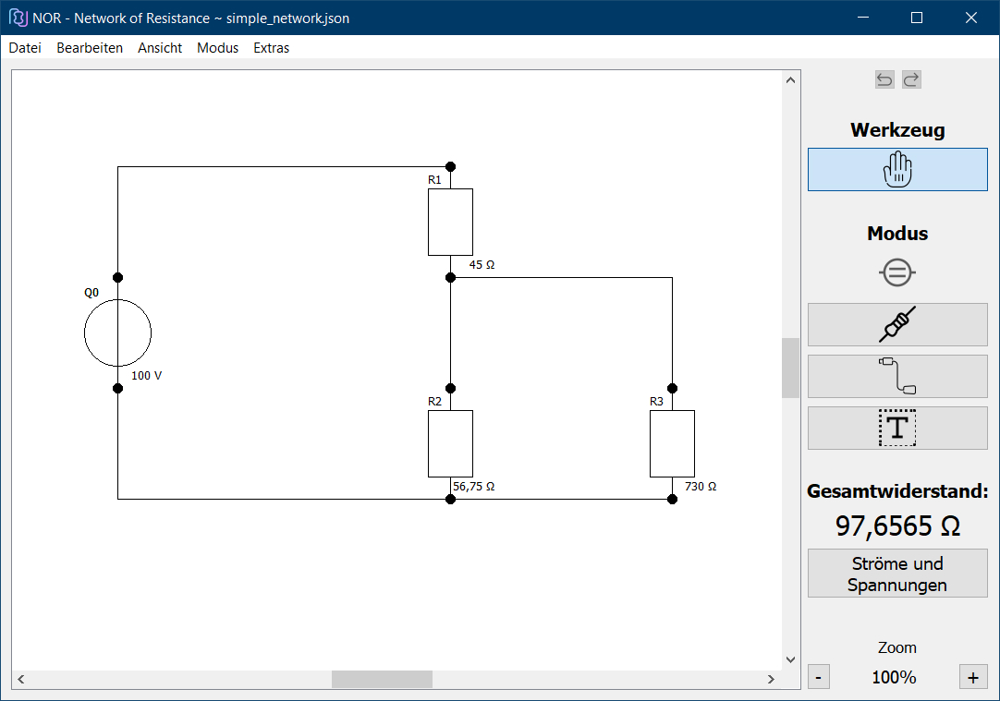

  

NOR - Network of Resistance
===========================
Einfaches Berechnen des Gesamtwiderstandes von elektrischen Netzwerken

#### Download: https://github.com/3ricS/NOR/releases

## Beschreibung
NOR kann den Gesamtwiderstand beliebiger Netzwerke von elektrischen Widerständen berechnen.
Darüber hinaus können die Spannungen und Ströme an jedem Widerstand abgerufen werden.
Die Netzwerke können gespeichert und gedruckt werden.
Als Entwicklungsumgebung wurde die Community-Version von Qt verwendet. 
Dieses Projekt wurde im Rahmen eines Studiensemsters an der [Privaten Hochschule Wirtschaft und Technik](https://www.phwt.de/) in Diepholz angefertigt. Als Ansprechpartner stand uns [Prof. Dr. H. Henseler](https://www.phwt.de/weiterbildung/referenten/prof-dr-herwig-henseler/) zur Seite.

## Screenshot

  

---

## Projektbeteiligte
- Eric Schniedermeyer
- Leonel Fransen
- Moritz Fichte
- Soeren Koestler

## Entwicklungszeitraum
20.01.2020 - 23.03.2020

## Copyright
Die Lizenzinformationen befinden sich unter License.md.

## Versionskontrolle
Als Versionskontrolle wird Git eingesetzt.

## Compiler
Desktop Qt 5.14.0 clang 64bit

## Erzeugung eines lauffähigen Programms
Für ein lauffähiges Programm muss der Quellcode in die Qt-Entwicklungsumgebung importiert werden und dort dann kompiliert werden.
Es ist keine Installation und damit einhergehende Konfiguration notwendig. Auch die Deinstallation entfällt. Das Programm wird über die Entwicklungsumgebung aufgerufen.

## Struktur des Codes
Als Leitlinie des Code-Styles wurden aus dem verbindlichen Styleguide (Version 1.8.1) der PHWT entnommen. Als Architektur-Pattern wurde das Model-View-Pattern sowie das Singleton verwendet.

## Verzeichnisstruktur
Die Quellcode-Datei befinden sich in src/, in diesem Ordner werden die Klassen nochmals in Model und View getrennt abgelegt. Außerdem liegen dort die Bilder bzw. Icons, die in unserem Programm verwendet werden.
Unter doc/ befinden sich das Klassendiagramm, das Lastenheft sowie die Protokolle.
Beispiele für elektrische Netzwerke, die mit dem Programm geladen werden können, finden sich unter examples/.

## Benutzerhandbuch
Die Doxygen-Datei befindet sich unter doxygen/

## Kooperationspartner

