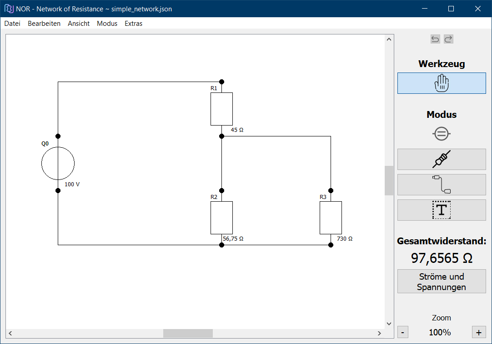

  

NOR - Network of Resistance
===========================
Einfaches Berechnen des Gesamtwiderstandes von elektrischen Netzwerken

#### Download: https://github.com/3ricS/NOR/releases

## Beschreibung
NOR kann den Gesamtwiderstand beliebiger Netzwerke von elektrischen Widerständen berechnen.
Darüber hinaus können die Spannungen und Ströme an jedem Widerstand abgerufen werden.
Die Netzwerke können gespeichert und gedruckt werden.
Als Entwicklungsumgebung wurde die Community-Version von Qt verwendet. 
Dieses Projekt wurde im Rahmen eines Studiensemsters an der [Privaten Hochschule Wirtschaft und Technik](https://www.phwt.de/) in Diepholz angefertigt. Als Ansprechpartner stand uns [Prof. Dr. H. Henseler](https://www.phwt.de/weiterbildung/referenten/prof-dr-herwig-henseler/) zur Seite.

## Screenshot

  

---

## Projektbeteiligte
- Eric Schniedermeyer
- Leonel Fransen
- Moritz Fichte
- Sören Köstler

## Entwicklungszeitraum
seit 20.01.2020

## Lizent
Die Lizenzinformationen befinden sich unter [License.md].
Es wird die Community-Version von Qt eingesetzt.

## Compiler
Desktop Qt 5.14.1 clang 64bit

## Erzeugung eines lauffähigen Programms
Das Programm kann unter https://github.com/3ricS/NOR/releases direkt heruntergeladen und installiert werden.  
Um aus dem Quellcode ein lauffähiges Programm zu erzeugen, muss dieser mit dem Qt Creator geöffnet und kompiliert werden, wodurch die Installation entfällt. Dazu muss die Datei src/NOR.pro mit dem Qt Creator geöffnet werden.

## Struktur des Codes
Als Architektur-Pattern wurde das Model-View-Pattern verwendet. Als Leitlinie des Code-Styles wurden aus dem verbindlichen Styleguide (Version 1.8.1) der PHWT entnommen.

## Verzeichnisstruktur
Die Quellcode-Datei befinden sich in src/, in diesem Ordner werden die Klassen nochmals in Model und View getrennt abgelegt. Außerdem liegen dort unter src/img die Bilder bzw. Icons, die in unserem Programm verwendet werden.
Unter doc/ befinden sich das Klassendiagramm und das Lastenheft sowie die Doxygen-Datei.
Beispiele für elektrische Netzwerke, die mit dem Programm geladen werden können, finden sich unter examples/.

## Benutzerhandbuch
Die Doxygen-Datei befindet sich unter doc/doxygen/

## Kooperationspartner

